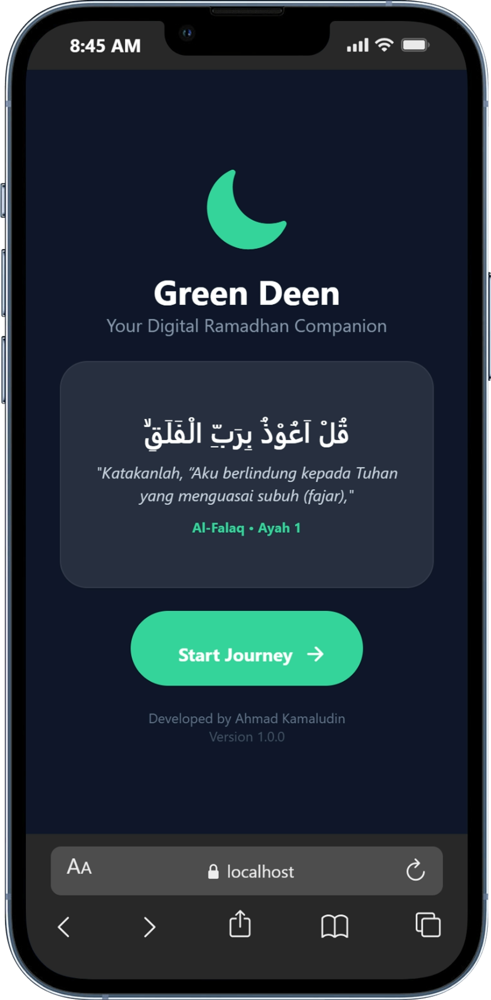
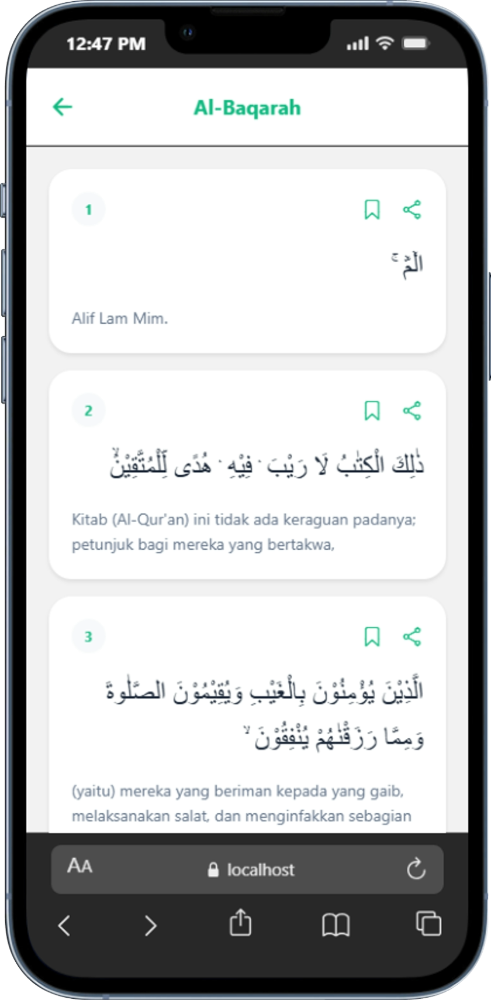
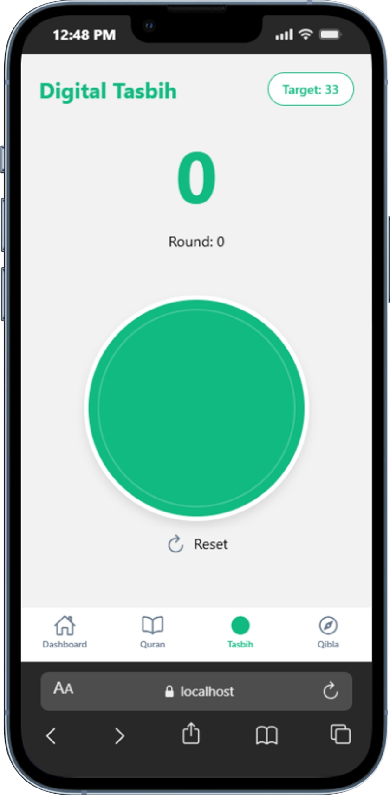
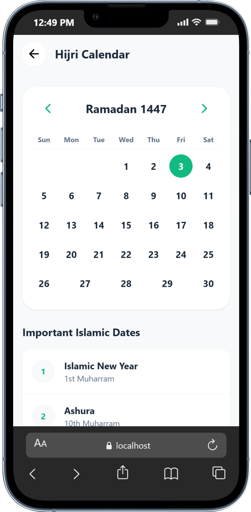
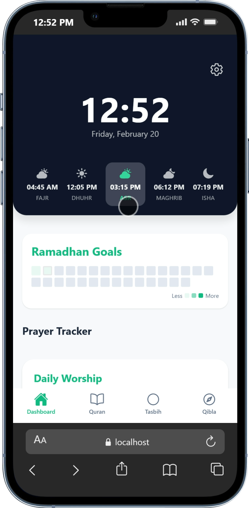
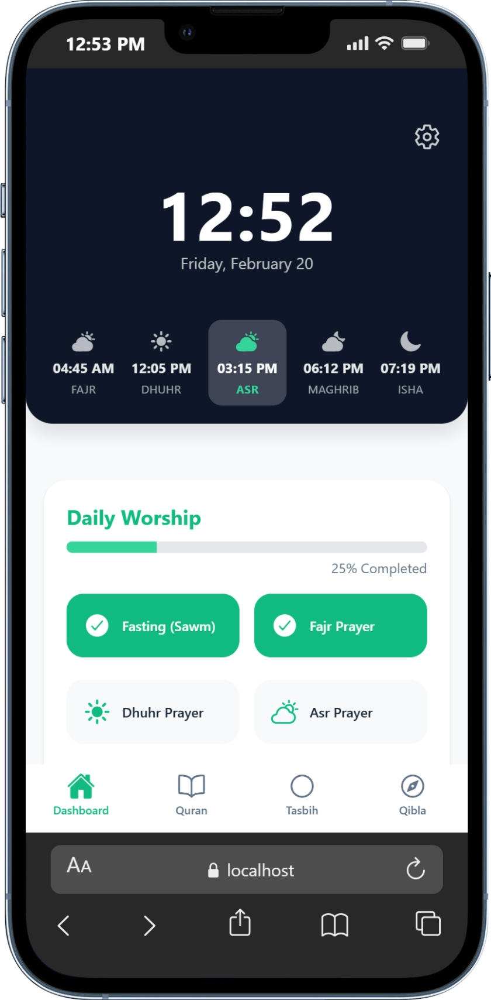

# GreenDeen 🌙

GreenDeen is a modern Islamic lifestyle application designed to accompany Muslims in their daily worship. Built with React Native and Expo, it offers a seamless and beautiful user experience for accessing the Quran, prayer times, Qibla direction, and more.

## ✨ Features

- **📖 Al-Quran**: complete digital Quran with Surah listings and a comfortable reading view.
- **🕌 Prayer Times**: Accurate prayer times calculated based on your location using the `adhan` library.
- **🧭 Qibla Compass**: Real-time Qibla direction using device sensors.
- **📿 Digital Tasbih**: A simple and intuitive Tasbih counter for your daily Dhikr.
- **🤲 Dua Collection**: Essential Duas for various occasions and needs.
- **📅 Hijri Calendar**: Stay updated with the Islamic calendar dates.
- **📊 Worship Tracker**: Track your Ramadhan goals and daily worship progress.
- **⚙️ Customization**: Personalize your app experience through the settings.

## 📱 Screenshots

<div style="display: flex; flex-direction: row; overflow-x: auto;">
  
  
  
  
  
  
  
</div>


## 🛠 Tech Stack

- **Framework**: [React Native](https://reactnative.dev/) with [Expo](https://expo.dev/) (SDK 50+)
- **Styling**: [NativeWind](https://www.nativewind.dev/) (Tailwind CSS for React Native)
- **Navigation**: [React Navigation](https://reactnavigation.org/) (Stack & Bottom Tabs)
- **Icons**: [Lucide React Native](https://lucide.dev/guide/packages/lucide-react-native) & Ionicons
- **Location**: `expo-location`
- **Sensors**: `expo-sensors` (Magnetometer for Qibla)
- **Haptics**: `expo-haptics`

## 🚀 Getting Started

### Prerequisites

- [Node.js](https://nodejs.org/) (LTS)
- [Expo CLI](https://docs.expo.dev/get-started/installation/)

### Installation

1.  **Clone the repository**

    ```bash
    git clone https://github.com/Start-Of-Something-New/GreenDeen.git
    cd GreenDeen
    ```

2.  **Install dependencies**

    ```bash
    npm install
    ```

### Running the App

1.  **Start the development server**

    ```bash
    npx expo start
    ```

2.  **Run on your device**

    -   **Android**: Press `a` in the terminal (requires Android Studio/Emulator) or scan the QR code with Expo Go.
    -   **iOS**: Press `i` in the terminal (requires Xcode/Simulator) or scan the QR code with the Camera app.
    -   **Web**: Press `w` to run in the browser.

## 📂 Project Structure

```
GreenDeen/
├── assets/          # Static assets (images, fonts)
├── components/      # Reusable UI components (PrayerCard, Logic files, etc.)
├── data/            # JSON data (Quran, Duas, etc.)
├── screens/         # App screens (Dashboard, Quran, etc.)
├── utils/           # Helper functions, Context, and Constants
├── App.js           # Main entry point & Navigation setup
├── app.json         # Expo configuration
├── tailwind.config.js # NativeWind configuration
└── package.json     # Project dependencies
```

## 🤝 Contributing

Contributions are welcome! If you have suggestions or improvements, please fork the repository and submit a pull request.

## 📄 License

This project is open-source and available under the [MIT License](LICENSE).

---

Made with ❤️ by [Ahmad Kamaludin](https://github.com/AhmadKamaludin24)
